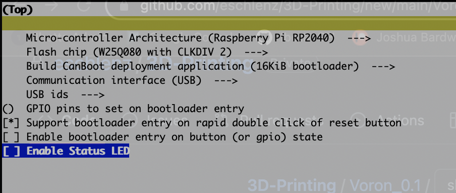
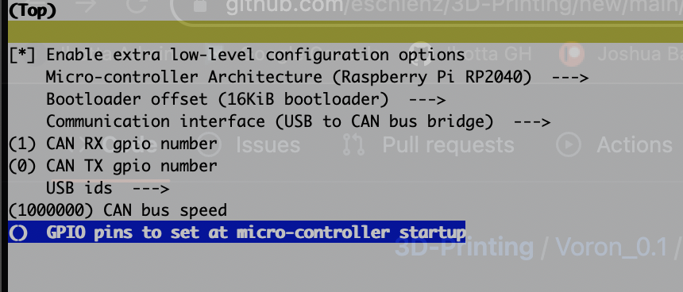

# Setting up your BTT SKR Pico to use CanBoot bootloader and Klipper with USB to CAN Bridge
This is a simple guide to getting the CanBoot bootloader, and Klipper with USB to CAN Bridge working.

## Assumptions
1. You know the general `make clean; make menuconfig; make` pattern typically seen with flashing MCUs.
2. You already have a printer working with a Raspberry Pi connected to the SKR Pico over USB.
3. You understand that you will be overwriting the current firmware on the BTT SKR Pico.

## Compiling CanBoot
1. SSH into your RPi
2. If you don't already have CanBoot cloned, run `git clone https://github.com/Arksine/CanBoot.git`
3. Run the following commands to get into the CanBoot configurator:
  ```
  cd CanBoot
  make clean
  make menuconfig
  ```
4. Make sure your settings match this screenshot:
  
5. Hit 'q' to quit, and 'y' to save
6. Run `make`

Checkpoint 1: The CanBoot bootloader file is now ready to be flashed to the SKR Pico. We'll do that next.

## Flashing CanBoot to the SKR Pico
1. Add a jumper to the BOOT pins on your SKR Pico
2. Hit the reset button on your SKR Pico (this puts it into DFU/firmware flashing mode)
3. Confirm that the SKR Pico is in DFU mode by doing the following:
    1. WARNING: Before running the following step, confirm whether your Pico appears as `/dev/sda1`. You may need to replace `sda1` with something else depending on your setup. You can list your devices using the `lsblk` command.
    2. Run: `sudo mount /dev/sda1 /mnt`
    3. Run: `ls /mnt`
    4. You should see the following files: `INDEX.HTM`, `INFO_UF2.TXT`
4. Run: sudo cp ~/CanBoot/out/canboot.uf2 /mnt
5. The SKR Pico will now flash the CanBoot bootloader. You can confirm this process is complete by continuously running `ls /mnt` until you no longer see a list of files
6. Remove the BOOT jumper
7. Power off your printer, then power it back on

Checkpoint 2: At this point the CanBoot bootloader should now be flashed to your SKR Pico. Next steps are to flash Klipper with USB to CAN Bridge.

## Compiling Klipper with USB to CAN Bridge via CanBoot
1. SSH into your Pi
2. Run:
  ```
  cd klipper
  make clean
  make menuconfig
  ```
3. Make sure your settings match this screenshot:
  
4. Hit 'q' to quit, and 'y' to save
5. Run `make`

Checkpoint 3: You have now compiled a version of Klipper with USB to CAN Bridge enabled. We'll flash it to the SKR Pico next.

## Flashing Klipper via CanBoot to the SKR Pico
1. Run `ls /dev/serial/by-id` and note the serial ID that contains the word `CanBoot` in it
2. Flash Klipper by running: `python3 ~/CanBoot/scripts/flash_can.py -f ~/klipper/out/klipper.bin -d /dev/serial/by-id/{your serial id}`
    1. If it wasn't obvious, you need to replace `{your serial id}` with the serial ID from step 1
3. The script will run, and you should see `CAN Flash Success` at the end
4. Power off your printer, then power it back on
5. SSH into your Pi
6. Run: `sudo ip link set up can0 type can bitrate 1000000`
    1. This will bring up the CAN network
7. Run: `~/klippy-env/bin/python ~/klipper/scripts/canbus_query.py can0`
    1. This will list CAN devices on the network. You should see at least one, which is the CAN id for your SKR Pico. Write it down!
8. To help the CAN network survive firmware restarts, we'll want to configure the `can0` network to "allow for hotplug". 
    1. Run the following:
    ```
    sudo rm /etc/network/interfaces.d/can0
    sudo nano /etc/network/interfaces.d/can0
    ```
    2. Paste the following into the text editor:
    ```
    allow-hotplug can0
    iface can0 can static
        bitrate 1000000
        up ifconfig $IFACE txqueuelen 128
    ```
    3. Press `Ctrl+X` to exit the editor, followed by `Y` and `Enter` to save changes
9. Power off your printer, then power it back on

Checkpoint 4: You now have the CanBoot bootloader and Klipper with USB to CAN Bridge flashed to your SKR Pico!!! Next steps, update your printer.cfg.

At this point your SKR Pico Klipper instance is no longer available over a serial connection, and your printer isn't quite ready to use again. We need to update
the `[mcu]` config block for your SKR Pico.

## Updating your printer.cfg
1. Through the Mainsail/Fluidd UI, open your `printer.cfg` (or whatever file you have your `[mcu]` defined in).
2. Replace:
  ```
  [mcu]
  serial: /dev/serial/by-id/<your serial id>
  ```
  
  with
  ```
  [mcu]
  canbus_uuid: <your canbus id>
  ```
3. Restart Kliipper
4. After Klipper restarts you should see your MCU connected in Mainsail/Fluidd

## FINISH LINE
If everything was successful then you now have CanBoot and Klipper with the USB to CAN bridge working. This means you can now add more CAN devices to your network, such as the EBB36.
There are plenty of guides out there for connecting different CAN tool head PCBs. For example, here's a good one (note: you can ignore the steps
in this article for flashing your SKR Pico since we already have that setup with the bonus of CanBoot!): [Article](https://github.com/rootiest/zippy-klipper_config/blob/master/guides/Guide-pico_can.md).


